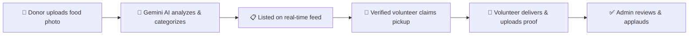
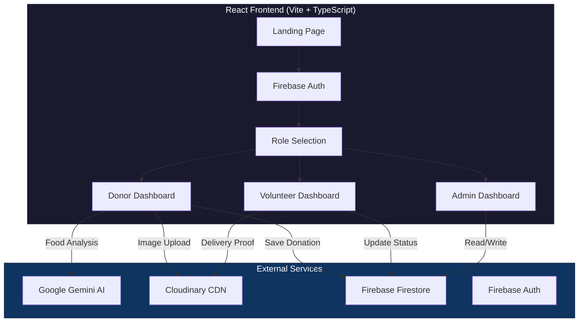
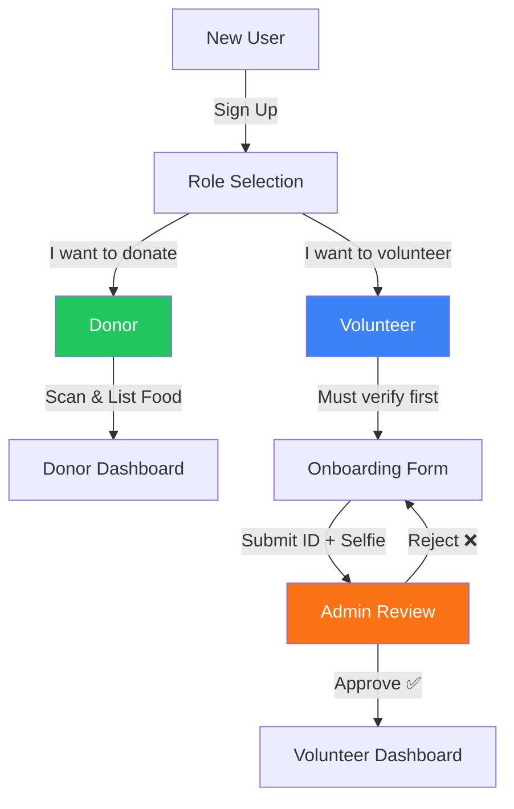

<div align="center">

# 🍽️ OpenTable — AI-Powered Food Rescue Platform

**Eliminating food waste by connecting surplus food with communities in need.**

[](https://react.dev/)
[](https://www.typescriptlang.org/)
[](https://firebase.google.com/)
[](https://ai.google.dev/)
[](https://vite.dev/)
[](https://cloudinary.com/)
[](LICENSE)
[](https://opentable-alpha.vercel.app)
[](https://github.com/anandhukrishnaas1/OpenTable/actions)

[🌐 Live Demo](https://opentable-alpha.vercel.app) · [📝 Report Bug](https://github.com/anandhukrishnaas1/OpenTable/issues) · [✨ Request Feature](https://github.com/anandhukrishnaas1/OpenTable/issues)

</div>

---

## 📋 Table of Contents

- [Screenshots](#-screenshots)
- [Problem Statement](#-problem-statement)
- [Our Solution](#-our-solution)
- [Key Features](#-key-features)
- [Architecture](#-architecture)
- [Tech Stack](#-tech-stack)
- [Project Structure](#-project-structure)
- [Getting Started](#-getting-started)
- [Environment Variables](#-environment-variables)
- [Testing](#-testing)
- [User Roles & Flows](#-user-roles--flows)
- [AI Integration](#-ai-integration)
- [API Reference](#-api-reference)
- [Security](#-security)
- [Performance Optimizations](#-performance-optimizations)
- [Browser Compatibility](#-browser-compatibility)
- [Roadmap](#-roadmap)
- [Troubleshooting](#-troubleshooting)
- [Contributing](#-contributing)
- [License](#-license)

---

## 📸 Screenshots

| Landing Page | AI Food Scanner | Volunteer Dashboard |
|:---:|:---:|:---:|
|  | AI-powered food analysis with category detection | Browse pickups, claim deliveries, upload proof |

| Donor Dashboard | Admin Panel | Transparency Ledger |
|:---:|:---:|:---:|
| Scan food, list donations, track pickups | Approve volunteers, review deliveries | Public accountability log |

---

## 🎯 Problem Statement

**1.3 billion tons** of food is wasted globally every year, while **827 million people** go hungry. A massive portion of edible food from restaurants, caterers, and households is thrown away simply because there is no efficient system to redistribute it in time.

### The Gap

| Challenge | Impact |
|-----------|--------|
| No real-time visibility into surplus food | Edible food expires before it reaches people |
| Manual coordination between donors & volunteers | Delays cause spoilage |
| No quality verification for food safety | Trust issues prevent participation |
| No accountability in the delivery chain | Donors can't verify food reached the right people |

---

## 🏢 Chosen Vertical

**Vertical:** Social Good / Environmental Sustainability (Food Tech)

We chose this vertical because food waste combined with hunger is an incredibly solvable logistical problem, specifically suited for real-time mobile/web platforms and AI image recognition.

---

## 🎯 Approach and Logic

Our approach focuses on **removing friction** for food donors and **building trust** in the volunteer network. 

**Logic:**
1. **Donor Friction:** Restaurants won't donate if it takes 10 minutes to fill out a form. We use **Google Gemini AI** to let them just snap a photo—the AI fills in the category, quantity estimates, and safety tags automatically.
2. **Trust & Safety:** Charities won't accept food from unvetted strangers. We built an identity verification system and a digital "chain of custody" where every pickup and delivery is logged with photo proof.
3. **Real-time Sync:** Food spoils fast. We use Firebase Firestore to ensure the moment a donor lists food, every volunteer's feed updates instantly without refreshing.

---

## ⚙️ How the Solution Works

**OpenTable** is an AI-powered, real-time food rescue platform that creates a seamless bridge between food donors (restaurants, caterers, households) and communities in need, coordinated by verified volunteers.

### The Complete Flow



### Feature Roles
- **Donors:** Snap a photo of surplus food. Google Gemini AI automatically categorizes it and adds safety context. The donation is broadcasted via Firebase to all nearby volunteers instantly.
- **Volunteers:** Must submit ID and selfie for admin verification. Once approved, they see an active feed of available pickups, accept a task, get Google Maps directions, and must upload photo proof of the final delivery.
- **Admins:** Oversee the entire ecosystem. They approve/reject volunteer verifications, audit the delivery proofs, and can "clap" (reward) volunteers for completed drives.

---

## 📌 Assumptions Made

1. **Internet Access:** We assume both donors and volunteers have reliable internet access and smartphone cameras to take photos of the food and delivery proofs.
2. **Platform Moderation:** We assume there is a dedicated Admin team available to review volunteer applications in a timely manner so bottlenecks don't occur.
3. **Local Geography:** Initially, we assume operations are within a single metropolitan area, meaning any volunteer seeing the feed is reasonably close to the donation pickups (Google Maps handles the exact routing).
4. **Food Safety Norms:** We assume donors are following basic local health regulations before deciding an item is fit for donation.

---

## 💡 Key Features

### 🏪 For Donors
- **AI Food Scanner** — Snap a photo → Gemini AI identifies the food, category, freshness level, and safety window
- **One-Tap Listing** — Add quantity, contact, location → donation goes live instantly
- **Live Tracking** — See when your donation is claimed and delivered in real-time
- **GPS Integration** — Auto-detect location for faster listing

### 🙋 For Volunteers
- **Available Pickups Feed** — Browse all active food donations nearby
- **One-Click Claim** — Accept a pickup and get directions via Google Maps
- **Delivery Proof** — Camera integration to photograph delivery for accountability
- **Completed Tab** — Track all past deliveries and see admin 👏 recognition
- **One-Time Verification** — Verify identity once, accept unlimited deliveries

### 🛡️ For Admins
- **Approval Dashboard** — Review volunteer identity verification requests (ID photo + selfie)
- **Trust Scoring** — Assign trust scores to volunteers
- **Completed Deliveries** — View all delivery proof photos
- **Clap Recognition** — 👏 Applaud volunteers for successful deliveries
- **Status Management** — Approve, Flag, or Reject volunteer applications

### 🤖 AI-Powered Features
- **Food Image Recognition** — Category detection (produce, dairy, bakery, prepared meals, etc.)
- **Freshness Analysis** — AI estimates remaining shelf life and safety parameters
- **Smart Categorization** — Auto-fill donation details for faster listing

---

## 🏗 Architecture



### Data Flow

| Collection | Purpose | Key Fields |
|-----------|---------|------------|
| `users` | User profiles & roles | `uid`, `email`, `role`, `name` |
| `donations` | Food donation listings | `item`, `status`, `imageUrl`, `deliveryProofUrl`, `clappedByAdmin` |
| `volunteersrequest` | Volunteer verification | `idImageUrl`, `selfieUrl`, `status`, `trustScore` |

---

## 🛠 Tech Stack

| Layer | Technology | Purpose |
|-------|-----------|---------|
| **Framework** | React 19 + TypeScript | Component-based UI with type safety |
| **Build Tool** | Vite 6 | Lightning-fast HMR & optimized builds |
| **Styling** | Tailwind CSS | Utility-first responsive design |
| **Database** | Firebase Firestore | Real-time NoSQL database |
| **Authentication** | Firebase Auth | Google OAuth + Email/Password |
| **AI** | Google Gemini 2.0 Flash | Multimodal food image analysis |
| **Image CDN** | Cloudinary | Optimized image storage & delivery |
| **Icons** | Lucide React | Consistent icon system |
| **Deployment** | Vercel | Edge-optimized hosting |
| **PWA** | vite-plugin-pwa | Progressive Web App capabilities |

---

## 📁 Project Structure

```
OpenTable/
├── .github/                     # GitHub templates
│   ├── ISSUE_TEMPLATE/
│   │   ├── bug_report.md        # Bug report template
│   │   └── feature_request.md   # Feature request template
│   └── PULL_REQUEST_TEMPLATE.md # PR checklist template
├── public/                      # Static assets (logo, carousel images)
├── src/
│   ├── components/              # Reusable UI components
│   │   ├── DoodleBackground.tsx # Decorative background component
│   │   ├── ErrorBoundary.tsx    # Global error boundary with retry
│   │   ├── Layout.tsx           # App shell with navigation & footer
│   │   └── Toast.tsx            # Custom toast notification system
│   ├── config/                  # Application configuration
│   │   ├── env.ts               # Environment variable validation
│   │   └── index.ts             # Config barrel exports
│   ├── constants/               # App-wide constants & enums
│   │   └── index.ts             # Routes, roles, API URLs, collections
│   ├── contexts/                # React Context providers
│   │   ├── AdminContext.tsx     # Volunteer applications & admin actions
│   │   ├── AuthContext.tsx      # Authentication state & role management
│   │   └── DonationContext.tsx  # Donation CRUD & real-time sync
│   ├── hooks/                   # Custom React hooks
│   │   ├── index.ts             # Hook barrel exports
│   │   ├── useLocalStorage.ts   # Persistent state in localStorage
│   │   ├── useMediaQuery.ts     # Responsive breakpoint detection
│   │   └── useToast.ts          # Toast notification management
│   ├── pages/                   # Route-level page components
│   │   ├── AdminDashboard.tsx   # Approve volunteers, view deliveries
│   │   ├── DashboardSelection.tsx # Dashboard type selector
│   │   ├── DonorDashboard.tsx   # AI scan, list donations, track
│   │   ├── LandingPage.tsx      # Hero, features, animated landing
│   │   ├── LoginPage.tsx        # Auth (Google + Email/Password)
│   │   ├── OnboardingApplication.tsx # Volunteer identity verification
│   │   ├── RoleSelection.tsx    # Post-login role picker
│   │   ├── TransparencyLedger.tsx    # Public donation activity log
│   │   └── VolunteerDashboard.tsx    # Browse, claim, deliver, proof
│   ├── services/                # External service integrations
│   │   ├── cloudinary.ts        # Cloudinary image upload service
│   │   ├── firebase.ts          # Firebase initialization & helpers
│   │   └── geminiService.ts     # Google Gemini AI integration
│   ├── utils/                   # Shared utility functions
│   │   ├── cn.ts                # CSS class name combiner
│   │   ├── date.ts              # Date formatting & relative time
│   │   ├── image.ts             # Image processing & compression
│   │   └── index.ts             # Utility barrel exports
│   ├── App.tsx                  # Route definitions with lazy loading
│   ├── index.tsx                # React DOM entry point
│   └── types.ts                 # Shared TypeScript type definitions
├── .editorconfig                # Editor formatting standards
├── .env.example                 # Environment variable template
├── .eslintrc.js                 # ESLint configuration
├── .gitignore                   # Git ignore rules
├── .prettierrc                  # Prettier code formatting config
├── CHANGELOG.md                 # Version history (Keep a Changelog)
├── CODE_OF_CONDUCT.md           # Contributor Covenant CoC
├── CONTRIBUTING.md              # Contribution guidelines
├── LICENSE                      # MIT License
├── SECURITY.md                  # Security policy & reporting
├── firestore.rules              # Firebase security rules
├── package.json                 # Dependencies & scripts
├── tsconfig.json                # TypeScript configuration (strict)
├── vercel.json                  # Deployment config with caching
└── vite.config.ts               # Vite build configuration
```

---

## 🚀 Getting Started

### Prerequisites

- **Node.js** 18+ ([Download](https://nodejs.org/))
- **npm** 9+
- A **Firebase** project ([Create one](https://console.firebase.google.com/))
- A **Cloudinary** account ([Sign up](https://cloudinary.com/))

### Installation

```bash
# 1. Clone the repository
git clone https://github.com/anandhukrishnaas1/OpenTable.git
cd OpenTable

# 2. Install dependencies
npm install

# 3. Set up environment variables (see section below)
cp .env.example .env

# 4. Start the development server
npm run dev
```

The app will be available at `http://localhost:5173`

### Build for Production

```bash
npm run build
npm run preview
```

---

## 🔐 Environment Variables

Create a `.env` file in the root directory with the following variables:

| Variable | Description | Required |
|----------|-------------|----------|
| `VITE_FIREBASE_API_KEY` | Firebase project API key | ✅ |
| `VITE_OPENROUTER_API_KEY` | OpenRouter API key for Gemini AI | ✅ |
| `VITE_CLOUDINARY_CLOUD_NAME` | Cloudinary cloud name | ✅ |
| `VITE_CLOUDINARY_UPLOAD_PRESET` | Cloudinary unsigned upload preset | ✅ |

```env
VITE_FIREBASE_API_KEY=your_firebase_api_key
VITE_OPENROUTER_API_KEY=your_openrouter_api_key
VITE_CLOUDINARY_CLOUD_NAME=your_cloud_name
VITE_CLOUDINARY_UPLOAD_PRESET=your_upload_preset
```

> ⚠️ **Security**: The `.env` file is gitignored. Never commit API keys to version control.

---

## 🧪 Testing

OpenTable uses [Vitest](https://vitest.dev/) for unit and integration testing.

### Run Tests

```bash
# Run all tests once
npm run test

# Run tests in watch mode (re-runs on file changes)
npm run test:watch

# Run tests with coverage report
npm run test:coverage
```

### Test Structure

```
src/__tests__/
├── setup.ts           # Test environment setup (matchMedia & localStorage mocks)
└── utils.test.ts      # Unit tests for date, image, and className utilities
```

### Validation Pipeline

```bash
# Run all quality checks (typecheck + lint + format + test)
npm run validate
```

---

## 👥 User Roles & Flows

### Role Hierarchy



### Donor Flow
1. Sign up / Login → Select "Donor" role
2. Take a photo of food → AI analyzes it
3. Add quantity, contact, address → Submit donation
4. Track when volunteer picks it up

### Volunteer Flow
1. Sign up / Login → Select "Volunteer" role
2. Complete identity verification (ID photo + selfie)
3. Admin reviews & approves (one-time process)
4. Browse available pickups → Claim → Deliver → Upload proof photo
5. See completed deliveries & admin recognition

### Admin Flow
1. Login with admin account
2. Review pending volunteer verifications
3. Approve / Flag / Reject applications
4. View completed deliveries & delivery proof photos
5. 👏 Clap for outstanding volunteers

---

## 🤖 AI Integration

OpenTable uses **Google's Gemini 2.0 Flash** model via OpenRouter for intelligent food analysis:

```typescript
// Example AI prompt structure
const prompt = `Analyze this food image and provide:
- Food item name
- Category (produce, dairy, bakery, prepared, etc.)
- Estimated freshness condition
- Safe distribution window
- Storage recommendations`;
```

### AI Capabilities
| Feature | Description |
|---------|-------------|
| **Food Recognition** | Identifies food type from photos |
| **Category Detection** | Auto-categorizes into food groups |
| **Freshness Estimation** | AI-assessed quality and safety |
| **Smart Pre-fill** | Auto-populates donation form fields |

---

## � API Reference

For detailed API documentation of all external service integrations, see [docs/API.md](docs/API.md).

For architecture diagrams and design decisions, see [docs/ARCHITECTURE.md](docs/ARCHITECTURE.md).

---

## �🔒 Security

| Layer | Implementation |
|-------|---------------|
| **Authentication** | Firebase Auth (Google OAuth + Email/Password) |
| **Authorization** | Role-based access (user, volunteer, admin) |
| **Database Rules** | Firestore rules require `request.auth != null` for all operations |
| **API Keys** | Stored in environment variables, never committed to git |
| **Image Storage** | Cloudinary with unsigned upload presets (no API secret exposed) |
| **Identity Verification** | ID photo + selfie required for volunteer approval |

---

## ⚡ Performance Optimizations

| Optimization | Impact |
|-------------|--------|
| **React.lazy + Suspense** | ~60-70% reduction in initial bundle size via code splitting |
| **Preconnect hints** | 200-500ms faster first API calls (Firebase, Cloudinary, Fonts) |
| **Browser caching (vercel.json)** | JS/CSS cached 1 year; images cached 1 day with stale-while-revalidate |
| **Cloudinary CDN** | Images served from nearest edge node |
| **Vite build** | Tree-shaking, minification, chunk splitting |
| **Firebase onSnapshot** | Real-time sync without polling |

---

## 🌐 Browser Compatibility

| Browser | Supported | Notes |
|---------|-----------|-------|
| Chrome 90+ | ✅ | Recommended |
| Firefox 90+ | ✅ | Full support |
| Safari 15+ | ✅ | Full support |
| Edge 90+ | ✅ | Full support |
| Mobile Chrome | ✅ | PWA installable |
| Mobile Safari | ✅ | PWA installable |

---

## 🗺️ Roadmap

- [x] AI-powered food scanning with Gemini
- [x] Volunteer identity verification system
- [x] Admin dashboard with clap recognition
- [x] Real-time donation tracking
- [x] Progressive Web App (PWA) support
- [ ] Push notifications for new donations
- [ ] Geo-based donation matching (nearest volunteer)
- [ ] Multi-language support (i18n)
- [ ] Donor impact analytics dashboard
- [ ] Mobile-native app (React Native)

---

## ❓ Troubleshooting

<details>
<summary><strong>Build fails with "Missing environment variables"</strong></summary>

Ensure all required variables are set in your `.env` file. Copy from the template:
```bash
cp .env.example .env
```
Then fill in your API keys. See [Environment Variables](#-environment-variables) for details.
</details>

<details>
<summary><strong>Firebase Auth not working</strong></summary>

1. Ensure your Firebase project has **Authentication** enabled
2. Enable the **Google** and **Email/Password** sign-in providers
3. Add your domain (`localhost` for development) to the authorized domains list in Firebase Console → Authentication → Settings
</details>

<details>
<summary><strong>AI food scanning returns "Unknown Item"</strong></summary>

1. Verify your `VITE_OPENROUTER_API_KEY` is valid
2. Check that you have sufficient credits on [OpenRouter](https://openrouter.ai/)
3. Ensure the image is clear and well-lit for best AI results
</details>

<details>
<summary><strong>Cloudinary upload fails</strong></summary>

1. Verify `VITE_CLOUDINARY_CLOUD_NAME` matches your Cloudinary account
2. Ensure the upload preset (`VITE_CLOUDINARY_UPLOAD_PRESET`) exists and is set to **unsigned**
3. Check your Cloudinary plan's upload limits
</details>

<details>
<summary><strong>Tests failing after fresh clone</strong></summary>

```bash
# Clean install dependencies
rm -rf node_modules package-lock.json
npm install

# Run tests
npm run test
```
</details>

---

## 🤝 Contributing

Contributions are welcome! Please read our [Contributing Guidelines](CONTRIBUTING.md) before getting started.

1. **Fork** the repository
2. **Create** a feature branch (`git checkout -b feature/amazing-feature`)
3. **Commit** your changes (`git commit -m 'Add amazing feature'`)
4. **Push** to the branch (`git push origin feature/amazing-feature`)
5. **Open** a Pull Request

See [CONTRIBUTING.md](CONTRIBUTING.md) for detailed guidelines on code style, commit conventions, and PR requirements.

---

## 📄 License

This project is licensed under the **MIT License** — see the [LICENSE](LICENSE) file for details.

---

## 🚀 Deployment

### Deploy to Vercel (Recommended)

1. Push your code to GitHub
2. Go to [vercel.com](https://vercel.com) and import your repository
3. Set the environment variables in the Vercel dashboard:
   - `VITE_FIREBASE_API_KEY`
   - `VITE_OPENROUTER_API_KEY`
   - `VITE_CLOUDINARY_CLOUD_NAME`
   - `VITE_CLOUDINARY_UPLOAD_PRESET`
4. Deploy — Vercel auto-detects Vite and configures the build

### Manual Deployment

```bash
# Build for production
npm run build

# Preview locally
npm run preview
```

The `dist/` folder can be deployed to any static hosting provider (Netlify, AWS S3, Firebase Hosting, etc.).

---

## ❓ FAQ

<details>
<summary><strong>Q: How do I get a Gemini AI API key?</strong></summary>

Sign up at [OpenRouter](https://openrouter.ai/) and generate an API key. OpenTable uses the `google/gemini-2.5-flash` model via OpenRouter's unified API.
</details>

<details>
<summary><strong>Q: Can I run this without AI features?</strong></summary>

Yes — the app works without the AI key, but the food scanning feature will be disabled. All other features (listing, claiming, delivery) work independently.
</details>

<details>
<summary><strong>Q: How do I become an admin?</strong></summary>

Manually set the `role` field to `"admin"` in the user's Firestore document under the `users` collection.
</details>

<details>
<summary><strong>Q: Is this project PWA-compatible?</strong></summary>

Yes! OpenTable is configured as a Progressive Web App via `vite-plugin-pwa`. Users can install it on mobile and desktop for an app-like experience.
</details>

<details>
<summary><strong>Q: How do I configure Firebase?</strong></summary>

1. Create a Firebase project at [console.firebase.google.com](https://console.firebase.google.com/)
2. Enable **Authentication** (Google + Email/Password providers)
3. Create a **Firestore** database
4. Copy the API key and add it to your `.env` file
</details>

---

## 🙏 Acknowledgements

- [Google Gemini AI](https://ai.google.dev/) — Multimodal AI engine
- [Firebase](https://firebase.google.com/) — Backend-as-a-Service
- [Cloudinary](https://cloudinary.com/) — Image management platform
- [Vercel](https://vercel.com/) — Edge deployment platform
- [Lucide Icons](https://lucide.dev/) — Icon library
- [Vite](https://vite.dev/) — Next-generation build tool

---

<div align="center">

**Built with ❤️ to fight food waste**

*OpenTable — Every meal matters.*

</div>
