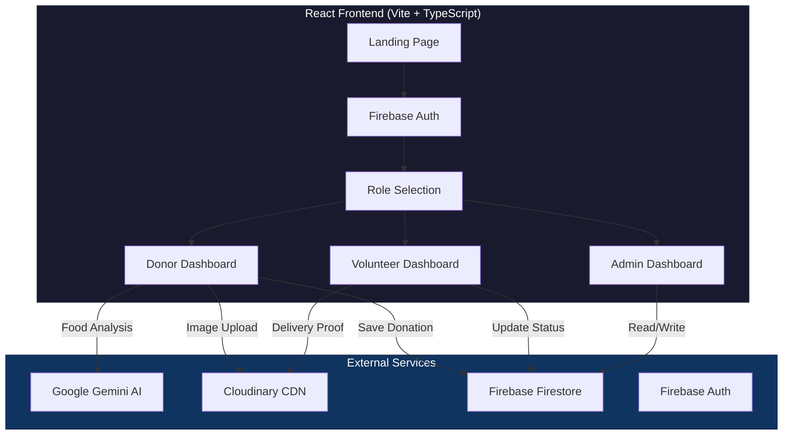
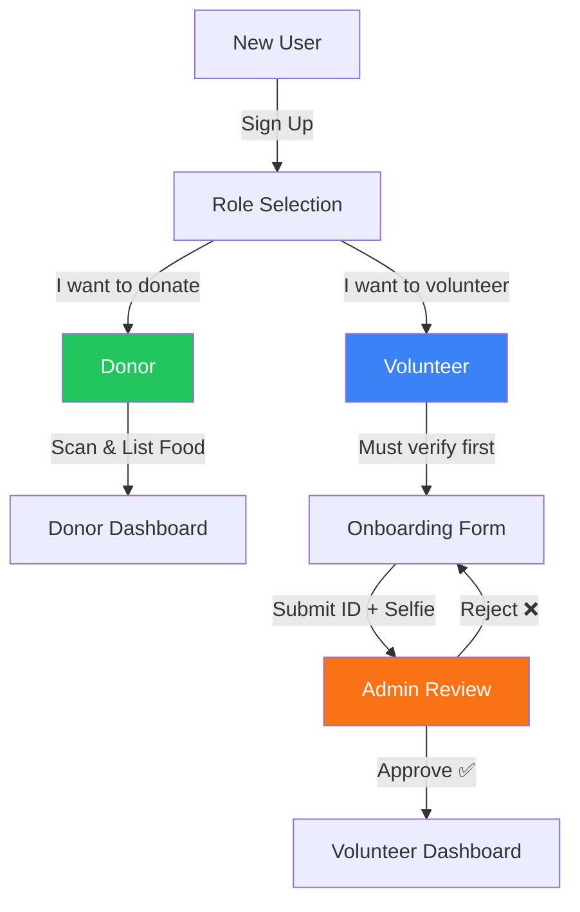

<div align="center">

# 🍽️ OpenTable — AI-Powered Food Rescue Platform

**Eliminating food waste by connecting surplus food with communities in need.**

[](https://react.dev/)
[](https://www.typescriptlang.org/)
[](https://firebase.google.com/)
[](https://ai.google.dev/)
[](https://vite.dev/)
[](https://cloudinary.com/)
[](LICENSE)
[](https://opentable-alpha.vercel.app)

[🌐 Live Demo](https://opentable-alpha.vercel.app) · [📝 Report Bug](https://github.com/anandhukrishnaas1/OpenTable/issues) · [✨ Request Feature](https://github.com/anandhukrishnaas1/OpenTable/issues)

</div>

---

## 📋 Table of Contents

- [Problem Statement](#-problem-statement)
- [Our Solution](#-our-solution)
- [Key Features](#-key-features)
- [Architecture](#-architecture)
- [Tech Stack](#-tech-stack)
- [Project Structure](#-project-structure)
- [Getting Started](#-getting-started)
- [Environment Variables](#-environment-variables)
- [User Roles & Flows](#-user-roles--flows)
- [AI Integration](#-ai-integration)
- [Security](#-security)
- [Performance Optimizations](#-performance-optimizations)
- [Contributing](#-contributing)
- [License](#-license)

---

## 🎯 Problem Statement

**1.3 billion tons** of food is wasted globally every year, while **828 million people** go hungry. A massive portion of edible food from restaurants, caterers, and households is thrown away simply because there is no efficient system to redistribute it in time.

### The Gap

| Challenge | Impact |
|-----------|--------|
| No real-time visibility into surplus food | Edible food expires before it reaches people |
| Manual coordination between donors & volunteers | Delays cause spoilage |
| No quality verification for food safety | Trust issues prevent participation |
| No accountability in the delivery chain | Donors can't verify food reached the right people |

---

## 💡 Our Solution

**OpenTable** is an AI-powered, real-time food rescue platform that creates a seamless bridge between food donors (restaurants, caterers, households) and communities in need, coordinated by verified volunteers.

### How It Works


### Key Differentiators

- **AI-First Approach** — Gemini multimodal AI auto-categorizes food, estimates freshness, and calculates safe distribution windows
- **Trust Layer** — Volunteers undergo identity verification (ID + selfie) before accepting deliveries
- **Full Accountability** — Delivery proof photos are required, creating an auditable chain of custody
- **Admin Governance** — Admin dashboard for volunteer approval, delivery oversight, and volunteer recognition (👏 clap feature)
- **Real-Time Sync** — Firebase Firestore provides instant updates across all connected users

---

## ✨ Key Features

### 🏪 For Donors
- **AI Food Scanner** — Snap a photo → Gemini AI identifies the food, category, freshness level, and safety window
- **One-Tap Listing** — Add quantity, contact, location → donation goes live instantly
- **Live Tracking** — See when your donation is claimed and delivered in real-time
- **GPS Integration** — Auto-detect location for faster listing

### 🙋 For Volunteers
- **Available Pickups Feed** — Browse all active food donations nearby
- **One-Click Claim** — Accept a pickup and get directions via Google Maps
- **Delivery Proof** — Camera integration to photograph delivery for accountability
- **Completed Tab** — Track all past deliveries and see admin 👏 recognition
- **One-Time Verification** — Verify identity once, accept unlimited deliveries

### 🛡️ For Admins
- **Approval Dashboard** — Review volunteer identity verification requests (ID photo + selfie)
- **Trust Scoring** — Assign trust scores to volunteers
- **Completed Deliveries** — View all delivery proof photos
- **Clap Recognition** — 👏 Applaud volunteers for successful deliveries
- **Status Management** — Approve, Flag, or Reject volunteer applications

### 🤖 AI-Powered Features
- **Food Image Recognition** — Category detection (produce, dairy, bakery, prepared meals, etc.)
- **Freshness Analysis** — AI estimates remaining shelf life and safety parameters
- **Smart Categorization** — Auto-fill donation details for faster listing

---

## 🏗 Architecture



### Data Flow

| Collection | Purpose | Key Fields |
|-----------|---------|------------|
| `users` | User profiles & roles | `uid`, `email`, `role`, `name` |
| `donations` | Food donation listings | `item`, `status`, `imageUrl`, `deliveryProofUrl`, `clappedByAdmin` |
| `volunteersrequest` | Volunteer verification | `idImageUrl`, `selfieUrl`, `status`, `trustScore` |

---

## 🛠 Tech Stack

| Layer | Technology | Purpose |
|-------|-----------|---------|
| **Framework** | React 19 + TypeScript | Component-based UI with type safety |
| **Build Tool** | Vite 6 | Lightning-fast HMR & optimized builds |
| **Styling** | Tailwind CSS | Utility-first responsive design |
| **Database** | Firebase Firestore | Real-time NoSQL database |
| **Authentication** | Firebase Auth | Google OAuth + Email/Password |
| **AI** | Google Gemini 2.0 Flash | Multimodal food image analysis |
| **Image CDN** | Cloudinary | Optimized image storage & delivery |
| **Icons** | Lucide React | Consistent icon system |
| **Deployment** | Vercel | Edge-optimized hosting |
| **PWA** | vite-plugin-pwa | Progressive Web App capabilities |

---

## 📁 Project Structure

```
OpenTable/
├── public/                     # Static assets (logo, carousel images)
├── src/
│   ├── components/             # Reusable UI components
│   │   ├── Layout.tsx          # App shell with navigation & footer
│   │   └── Toast.tsx           # Custom toast notification system
│   ├── contexts/               # React Context providers
│   │   ├── AuthContext.tsx      # Authentication state & role management
│   │   ├── DonationContext.tsx  # Donation CRUD & real-time sync
│   │   └── AdminContext.tsx     # Volunteer applications & admin actions
│   ├── pages/                  # Route-level page components
│   │   ├── LandingPage.tsx     # Hero, features, animated landing
│   │   ├── LoginPage.tsx       # Auth (Google + Email/Password)
│   │   ├── RoleSelection.tsx   # Post-login role picker
│   │   ├── DonorDashboard.tsx  # AI scan, list donations, track
│   │   ├── VolunteerDashboard.tsx # Browse, claim, deliver, proof
│   │   ├── AdminDashboard.tsx  # Approve volunteers, view deliveries
│   │   ├── OnboardingApplication.tsx # Volunteer identity verification
│   │   └── TransparencyLedger.tsx    # Public donation activity log
│   ├── services/               # External service integrations
│   │   ├── firebase.ts         # Firebase initialization & helpers
│   │   ├── geminiService.ts    # Google Gemini AI integration
│   │   └── cloudinary.ts       # Cloudinary image upload service
│   ├── App.tsx                 # Route definitions with lazy loading
│   ├── index.tsx               # React DOM entry point
│   └── types.ts                # Shared TypeScript type definitions
├── firestore.rules             # Firebase security rules
├── vercel.json                 # Deployment config with caching headers
├── vite.config.ts              # Vite build configuration
├── tsconfig.json               # TypeScript configuration
└── package.json                # Dependencies & scripts
```

---

## 🚀 Getting Started

### Prerequisites

- **Node.js** 18+ ([Download](https://nodejs.org/))
- **npm** 9+
- A **Firebase** project ([Create one](https://console.firebase.google.com/))
- A **Cloudinary** account ([Sign up](https://cloudinary.com/))

### Installation

```bash
# 1. Clone the repository
git clone https://github.com/anandhukrishnaas1/OpenTable.git
cd OpenTable

# 2. Install dependencies
npm install

# 3. Set up environment variables (see section below)
cp .env.example .env

# 4. Start the development server
npm run dev
```

The app will be available at `http://localhost:5173`

### Build for Production

```bash
npm run build
npm run preview
```

---

## 🔐 Environment Variables

Create a `.env` file in the root directory with the following variables:

| Variable | Description | Required |
|----------|-------------|----------|
| `VITE_FIREBASE_API_KEY` | Firebase project API key | ✅ |
| `VITE_OPENROUTER_API_KEY` | OpenRouter API key for Gemini AI | ✅ |
| `VITE_CLOUDINARY_CLOUD_NAME` | Cloudinary cloud name | ✅ |
| `VITE_CLOUDINARY_UPLOAD_PRESET` | Cloudinary unsigned upload preset | ✅ |

```env
VITE_FIREBASE_API_KEY=your_firebase_api_key
VITE_OPENROUTER_API_KEY=your_openrouter_api_key
VITE_CLOUDINARY_CLOUD_NAME=your_cloud_name
VITE_CLOUDINARY_UPLOAD_PRESET=your_upload_preset
```

> ⚠️ **Security**: The `.env` file is gitignored. Never commit API keys to version control.

---

## 👥 User Roles & Flows

### Role Hierarchy



### Donor Flow
1. Sign up / Login → Select "Donor" role
2. Take a photo of food → AI analyzes it
3. Add quantity, contact, address → Submit donation
4. Track when volunteer picks it up

### Volunteer Flow
1. Sign up / Login → Select "Volunteer" role
2. Complete identity verification (ID photo + selfie)
3. Admin reviews & approves (one-time process)
4. Browse available pickups → Claim → Deliver → Upload proof photo
5. See completed deliveries & admin recognition

### Admin Flow
1. Login with admin account
2. Review pending volunteer verifications
3. Approve / Flag / Reject applications
4. View completed deliveries & delivery proof photos
5. 👏 Clap for outstanding volunteers

---

## 🤖 AI Integration

OpenTable uses **Google's Gemini 2.0 Flash** model via OpenRouter for intelligent food analysis:

```typescript
// Example AI prompt structure
const prompt = `Analyze this food image and provide:
- Food item name
- Category (produce, dairy, bakery, prepared, etc.)
- Estimated freshness condition
- Safe distribution window
- Storage recommendations`;
```

### AI Capabilities
| Feature | Description |
|---------|-------------|
| **Food Recognition** | Identifies food type from photos |
| **Category Detection** | Auto-categorizes into food groups |
| **Freshness Estimation** | AI-assessed quality and safety |
| **Smart Pre-fill** | Auto-populates donation form fields |

---

## 🔒 Security

| Layer | Implementation |
|-------|---------------|
| **Authentication** | Firebase Auth (Google OAuth + Email/Password) |
| **Authorization** | Role-based access (user, volunteer, admin) |
| **Database Rules** | Firestore rules require `request.auth != null` for all operations |
| **API Keys** | Stored in environment variables, never committed to git |
| **Image Storage** | Cloudinary with unsigned upload presets (no API secret exposed) |
| **Identity Verification** | ID photo + selfie required for volunteer approval |

---

## ⚡ Performance Optimizations

| Optimization | Impact |
|-------------|--------|
| **React.lazy + Suspense** | ~60-70% reduction in initial bundle size via code splitting |
| **Preconnect hints** | 200-500ms faster first API calls (Firebase, Cloudinary, Fonts) |
| **Browser caching (vercel.json)** | JS/CSS cached 1 year; images cached 1 day with stale-while-revalidate |
| **Cloudinary CDN** | Images served from nearest edge node |
| **Vite build** | Tree-shaking, minification, chunk splitting |
| **Firebase onSnapshot** | Real-time sync without polling |

---

## 🤝 Contributing

Contributions are welcome! Please read our [Contributing Guidelines](CONTRIBUTING.md) before getting started.

1. **Fork** the repository
2. **Create** a feature branch (`git checkout -b feature/amazing-feature`)
3. **Commit** your changes (`git commit -m 'Add amazing feature'`)
4. **Push** to the branch (`git push origin feature/amazing-feature`)
5. **Open** a Pull Request

See [CONTRIBUTING.md](CONTRIBUTING.md) for detailed guidelines on code style, commit conventions, and PR requirements.

---

## 📄 License

This project is licensed under the **MIT License** — see the [LICENSE](LICENSE) file for details.

---

## 🙏 Acknowledgements

- [Google Gemini AI](https://ai.google.dev/) — Multimodal AI engine
- [Firebase](https://firebase.google.com/) — Backend-as-a-Service
- [Cloudinary](https://cloudinary.com/) — Image management platform
- [Vercel](https://vercel.com/) — Edge deployment platform
- [Lucide Icons](https://lucide.dev/) — Icon library
- [Vite](https://vite.dev/) — Next-generation build tool

---

<div align="center">

**Built with ❤️ to fight food waste**

*OpenTable — Every meal matters.*

</div>
