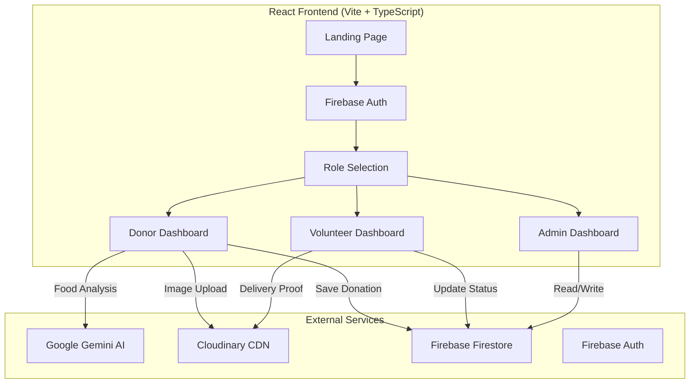
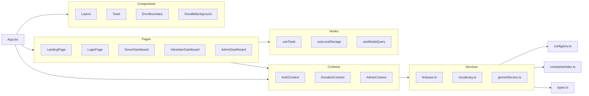
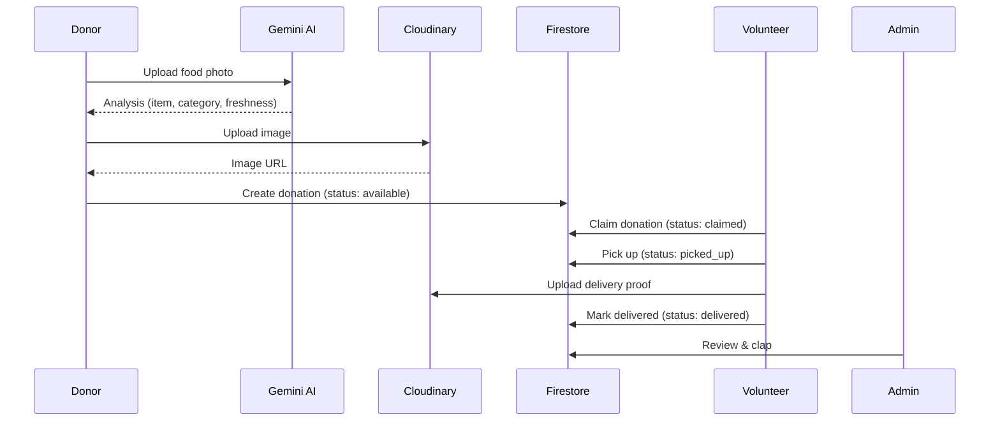

# Architecture Overview

> Technical architecture documentation for OpenTable.

## System Architecture



## Module Dependency Graph



## Directory Structure

```
src/
├── __tests__/       # Test files and setup
├── components/      # Reusable UI components (Layout, Toast, ErrorBoundary)
├── config/          # Environment variable validation
├── constants/       # App-wide constants (routes, roles, API URLs)
├── contexts/        # React Context providers (Auth, Donation, Admin)
├── hooks/           # Custom React hooks (useToast, useLocalStorage, useMediaQuery)
├── pages/           # Route-level page components (lazy-loaded)
├── services/        # External service integrations (Firebase, Cloudinary, Gemini AI)
├── styles/          # Global CSS and design tokens
├── utils/           # Shared utility functions (date, image, cn)
├── App.tsx          # Root component with routing
├── index.tsx        # React DOM entry point
└── types.ts         # Shared TypeScript type definitions
```

## Data Flow

### Donation Lifecycle



### Firestore Collections

| Collection | Purpose | Key Fields |
|-----------|---------|------------|
| `users` | User profiles & roles | `uid`, `email`, `role`, `name` |
| `donations` | Food donation listings | `item`, `status`, `imageUrl`, `deliveryProofUrl`, `clappedByAdmin` |
| `volunteersrequest` | Volunteer verification | `idImageUrl`, `selfieUrl`, `status`, `trustScore` |

## Key Design Decisions

| Decision | Rationale |
|----------|-----------|
| **Lazy loading all pages** | Reduces initial bundle by ~60-70% |
| **Centralized constants** | Eliminates magic strings, enables refactoring |
| **Environment validation** | Fails fast on missing config in production |
| **Barrel exports** | Clean import paths, easier refactoring |
| **Real-time Firestore listeners** | Instant UI updates without polling |
| **Cloudinary CDN** | Client-side uploads without backend server |
